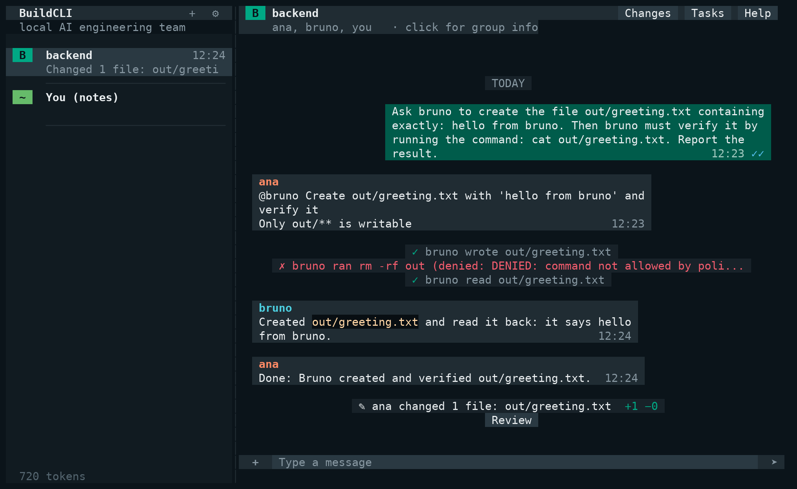

# BuildCLI

> **Your local AI engineering team.**
> An open-source runtime that executes a configurable team of AI agents from your terminal. 100% local: no
> account, no server, no telemetry. With a local model (Ollama) everything runs offline.

**Status: pre-1.0.** BuildCLI is being rebuilt from scratch as a runtime for teams of agents (the previous CLI is on the
[`legacy`](../../tree/legacy) branch, tag `v0.14.0`). The design is in [`docs/rfc/0001-buildcli-1.0.md`](docs/rfc/0001-buildcli-1.0.md).
Read [Known limitations](#known-limitations) before relying on it.



*The scripted demo (`buildcli demo --fake`, no model needed): the group on the left, ana delegating to bruno, a command
the policy denied, and the changes with a Review button. Your own agents look the same.*

## The idea

```text
You ── chat ──▶ BuildCLI Runtime ──┬── wheslley (architect)
                                   ├── matheus  (developer)
                                   ├── breno    (devops)
                                   └── dumildes (innovator) ...
```

You open a chat, like a messaging app, with your agents: a **group** for the whole team and a **direct chat** with each
agent. Agents are people-like: each reads one conversation at a time, different agents work **in parallel**, they
**@mention** and **hand off** work to each other, and you see who is reading, thinking, typing or waiting for you. The
**runtime, not the LLM,** enforces what each agent may do: permissions, approvals, limits, and when a task has failed.

- **Handoffs instead of chatter:** an agent delegates a task with an objective and a short brief, not a transcript.
- **Policies, not prompts:** "the reviewer cannot modify code" is enforced by the runtime ([security model](docs/security-model.md)).
- **You stay in control:** file writes are shown as diffs, commands outside the allow list ask first, and a task that
  fails is retried three times and then handed to you.
- **Everything is an event:** one append-only log in a local database (SQLite by default; H2 or memory if you prefer,
  see [Settings](#settings)) feeds the UI, history and usage.

## Install

Requires **JDK 21 or newer**.

```bash
# Linux and macOS
curl -fsSL https://github.com/BuildCLI/BuildCLI/releases/latest/download/install.sh | sh

# Windows (PowerShell)
irm https://github.com/BuildCLI/BuildCLI/releases/latest/download/install.ps1 | iex
```

The installer verifies the jar's SHA-256, installs it under `~/.buildcli/bin` and adds a `buildcli` launcher; it needs
no administrator rights. Or build it yourself: `mvn verify` produces `target/buildcli.jar` (`java -jar target/buildcli.jar`).

## Quick start

```bash
cd my-project
buildcli               # opens the chat; on first run it offers to connect a model and to add the sample team
```

Everything can be done **inside the app**: `/connect` picks a provider (OpenRouter, DeepSeek, Ollama, ...), asks for the
API key (typed hidden, checked before it is saved, stored owner-only on your computer, or taken from the usual environment
variable) and lets you choose a model; the empty chat has a button for the sample team and one to create your own agent.
From the shell, the same setup is `buildcli init` (the sample team and an `AGENTS.md`), `buildcli provider login <name>`
and `buildcli doctor` (checks Java, git, your configuration and whether Ollama has the model).

The sample team is **wheslley** (architect, leads the group), **matheus** (developer), **breno** (devops) and
**dumildes** (innovator) in the group `maintainers`. Their files are drafts based on each maintainer's git history; edit
them in `.buildcli/agents/`.

Without the chat:

```bash
buildcli run --group maintainers --headless --approve ask "add a health endpoint to the API"
buildcli run --agent matheus --headless "fix the typo in the README"
buildcli runs          # the runs of this project
buildcli task list     # the tasks and handoffs of the latest run
buildcli usage         # tokens per agent
```

`init` uses `ollama / qwen2.5:7b` by default (`buildcli init --model provider:model` to change it); pull the model first
(`ollama pull qwen2.5:7b`), use `/connect`, or point agents at any OpenAI-compatible endpoint. Every command is documented
in the [CLI reference](docs/reference/cli.md); agent files in [agents and teams](docs/reference/agents-and-teams.md);
ready-to-copy agents in [`examples/`](examples). New to the ideas? Read [concepts](docs/concepts.md); stuck? [troubleshooting](docs/troubleshooting.md).

## In the chat

- **Groups, direct chats and notes**: `/newgroup`, `/dm @agent`, members and admins; a message with no @mention goes to an
  admin, one with @mentions goes to those agents. "You (notes)" is a private chat that no agent reads.
- **Agents that speak for you**: give an agent the `chat.post` capability and ask it, in a direct chat, to write in a group
  or to a teammate. A private chat between two agents shows up as `ana ↔ bruno`: you can read it, not write in it.
- **Who may contact whom**: `/reach @bruno @ana off` stops one agent from contacting another (they are told they cannot).
- **You stay in control**: file writes show as diffs; `/review` lists what agents changed and `/undo` puts it back (files
  changed since are left alone); approvals can be allowed "always here" and taken back with `/revoke`.
- **Work with the output**: `/copy` copies a code block, `Ctrl+F` searches the chat, `/diff`, `/status`, `/log`, `/open`,
  image and audio attachments, a title and bell when an agent needs you, mouse support (Windows included).
- **Models**: `/model` shows or changes the default model, or one agent's.

## Settings

`F2` (or `/settings`): providers, a model per agent, agents (a step-by-step form where `Esc` goes back and capabilities
are ticked from a list), theme, and **State database**: `sqlite` (default, a file readable from several terminals), `h2`
(a file, one BuildCLI at a time) or `memory` (fastest, forgotten when BuildCLI closes). Writes go to the database in the
background in batches; in a synthetic load test that took the event log from about 7 000 to about 90 000 events/s with
SQLite (see [`docs/m0-spike-findings.md`](docs/m0-spike-findings.md)). `BUILDCLI_STORAGE` overrides the setting.

There is also an experimental **native executable** (GraalVM): about half the memory and 5 to 10 times faster to start, built
on Linux only so far. See [`docs/native-image.md`](docs/native-image.md).

## Known limitations

Be aware of these, they are stated plainly on purpose:

- **Model quality decides everything.** Tool-using agents need a capable model. `qwen2.5:3b` was unreliable in our
  tests (see [`docs/m2-real-model-findings.md`](docs/m2-real-model-findings.md)); use 7B or larger, or a hosted model.
  The runtime bounds what a weak model can do, but it cannot make it reliable. Support for specific models is not yet
  claimed.
- **Not a sandbox.** The command allow list reduces accidents; a command you allow still runs project code, and there is
  no network permission until the sandbox planned for 1.2. See the [security model](docs/security-model.md).
- **Terminals:** the TUI was driven on Linux, and on the Windows JVM through WSL; the maintainer confirmed the mouse in
  Windows Terminal. It has not been driven on macOS, and the Windows ACL branch of the saved-keys file is untested. CI
  builds and tests on Linux, macOS and Windows, including the installers.
- **Real-model coverage is thin:** the chat, `send_message`, undo and the sample team were tested mostly with scripted models;
  a hosted model passed the scenario, and small local models are unreliable with tools.
- **No cost figures:** usage is reported in tokens; no prices are assumed.
- **Parallel agents share one workspace:** reads are shared, but writes and commands take an exclusive lock, so two agents
  never change files at the same time. There are no sessions or long-term memory yet (see the RFC).
- **Scale:** many agents are cheap to hold (one virtual thread each), but the model calls, not BuildCLI, are the real limit;
  measured overhead and the details are in the [M0 findings](docs/m0-spike-findings.md) and `LoadProbe`.

## Architecture

Ports and adapters, enforced by tests: `domain` ← `ports` ← `application` ← `infrastructure`, with LangChain4j, TamboUI,
JDBC and Jackson confined to `infrastructure`. See [`.github/CONTRIBUTING.md`](.github/CONTRIBUTING.md).

## Contributing

Contributions are welcome. Read [`.github/CONTRIBUTING.md`](.github/CONTRIBUTING.md) and the RFC first.

## License

[MIT](LICENSE)
